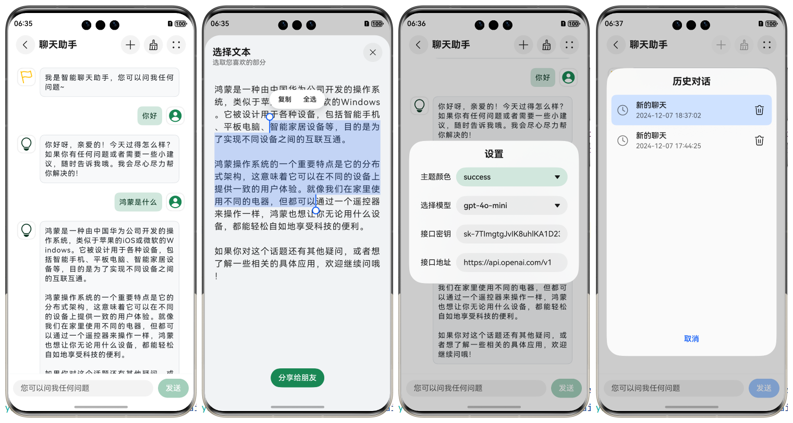

# @iuroc/chat-page

基于 OpenAI API 的智能聊天页面组件，根组件为 `NavDestination`。



## 安装模块

```shell
ohpm install @iuroc/chat-page
```

## 使用模块

```extendtypescript
import { ChatPage } from '@iuroc/chat-page'
import { preferences, relationalStore } from '@kit.ArkData'

// 设置用户首选项
const dataPreferences = preferences.getPreferencesSync(getContext(), { name: 'chat' })
// 设置 OpenAI 的密钥和请求地址
dataPreferences.putSync('openai_api_key', `sk-xxxxx`)
dataPreferences.putSync('openai_base_url', `https://api.openai.com/v1`)
// 设置关系型数据库
const getRdbStore = async () => {
    return relationalStore.getRdbStore(getContext(), {
        name: 'chat.db',
        securityLevel: relationalStore.SecurityLevel.S1
    })
}

@Builder
export function PageBuilder() {
    ChatPage({
        // 配置用户首选项
        dataPreferences,
        // 配置关系型数据库
        getRdbStore,
    })
}
```

## 属性

| 属性名                  | 必填 | 类型                                                                                                                                   | 描述                                                                   |
|----------------------|----|--------------------------------------------------------------------------------------------------------------------------------------|----------------------------------------------------------------------|
| dataPreferences      | 是  | [Preferences](https://developer.huawei.com/consumer/cn/doc/harmonyos-references-V5/js-apis-data-preferences-V5#preferences)          | 首选项实例，用于存储主题色、接口密钥等。                                                 |
| defaultOpenaiModel   | 否  | [ChatModel](https://github.com/openai/openai-node/blob/fbd968576357e635e541a3475a67fb741f603292/src/resources/chat/chat.ts#L46)      | 创建新对话时默认的模型名称，默认为 gpt-4o-mini。                                       |
| defaultOpenaiBaseURL | 否  | string                                                                                                                               | 当用户首选项中的 `openai_base_url` 缺省时的默认请求地址，默认为 https://api.openai.com/v1。 |
| defaultThemeColor    | 否  | [BSColorNameMap](https://github.com/iuroc/ohpm-bootstrap5-color/blob/945f8da1d8a154ff0780e66123d30ecc31e0a967/library/Index.ets#L10) | 默认的主题颜色名称，颜色方案来自 Bootstrap V5，默认为 success。                           |
| defaultChatTitle     | 否  | string                                                                                                                               | 创建新对话时，默认的对话标题，默认为“聊天助手”。                                            |
| inputMessage         | 否  | string                                                                                                                               | 载入页面时，消息输入框的默认文本，默认为空。                                               |
| openaiCanConfig      | 否  | boolean                                                                                                                              | 设置面板中，是否显示 OpenAI 配置项，默认为 true。                                      |
| currentChatIndex     | 否  | number                                                                                                                               | 载入页面时，显示的默认对话下标，默认为 0 表示最新创建的对话，值越大表示越早创建。                           |

## 方法

| 方法名         | 必填 | 类型                                                                                                                                       | 描述               |
|-------------|----|------------------------------------------------------------------------------------------------------------------------------------------|------------------|
| getRdbStore | 是  | () => Promise<[RdbStore](https://developer.huawei.com/consumer/cn/doc/harmonyos-references-V5/js-apis-data-relationalstore-V5#rdbstore)> | 返回值为关系型数据库实例的方法。 |
